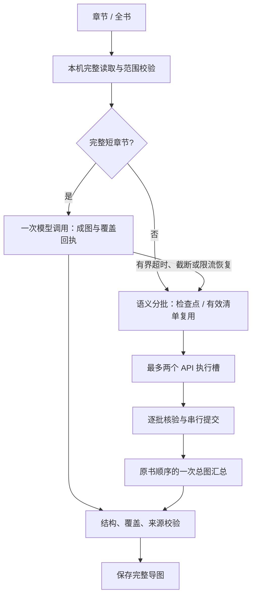

# 导图生成提速架构

日期：2026-09-23。状态：源码已实现，调度、恢复、引用协议与原创 EPUB 浏览器流程已验证；真实模型的延迟收益、完成率和语义质量尚未实测。

## 分层与入口

采用固定流程：本机完整取材 → 按目标大小路由 → 短章直接成图，或有限并行提取后一次汇总 → 校验保存。内部任务策略决定如何理解和组织观点；harness 控制权限、执行、预算、取消、复用及恢复。不引入多 Agent、外部工作流或服务。

生成入口只有选择章节与全书，不增加速度模式或 Skill 配置。只有主动生成/继续才读取正文及请求模型。工作区继续支持编辑、来源跳转、细化、追问与导出；保留个人修改和旧记录。

## 短章节直接成图

完整章节不超过 8,000 字符、100 来源且只需一个批次时，单次请求接收完整原文，返回 `{coveredSourceIds,map}`。覆盖回执须包含每个已提供 ID 且无重复，图须通过树结构及来源白名单校验。新结果使用 `mindmap-overview-3`，保留章节 coverage 和不可变生成依据。

超时、输出截断或 429 可以消耗一次恢复额度，转入清单流程；此前调用及等待仍计入同一次任务预算。非法结构、覆盖缺失及伪造来源直接拒绝。初始阈值用于保守限制输入，不能当作任何模型语义质量不退步的证明；真实对照评测仍需完成。

直接成图没有完整观点清单，因此只复用完整成图检查点，不把可见树写入观点缓存，也不额外发模型请求为未来缓存做准备。

## 长范围两路整理、一次汇总

先完整本机读取，再检查总字符、来源、语义分区和批次数；不能先发送样本、稍后才发现范围超限。批次继续不超过 20,000 字符/200 来源，标题串与首个正文块保持一起，段落与表格不截断。

同时计算原有语义打包与偏向章节边界的分区。章节分区仅在不增加批次数时采用，以便复用；多个短章不能仅为对齐缓存而增加模型请求。上下文或边界不同必须缓存未命中，不能按单个段落 ID 强行拼接清单。

两个普通异步工作循环处理未完成且没有有效清单的批次。一批完成即可领取下一批，不成对等待。每批输出完整覆盖回执和最多 12 个带来源观点，明确保留限定、反例、分歧以及有原文支持的关系。全部清单完成后按原书顺序输入汇总，合并主题并保留主要差异，不默认增加每章成图或二次模型审核。

主图沿用最多 24 节点/4 层。完整处理原文不意味着所有细节都会成为可见节点；不能把检索样本冒充完整结构。最终节点只能引用已有清单实际使用的来源。

## 调度、限流与预算

`scheduler.ts` 在同一应用窗口按规范化 API 端点共享至多两个请求槽，覆盖不同模型配置、导图任务及分支细化。跨窗口配额协调尚未实现；已有检查点 revision 仍阻止互相覆盖。

429 被 provider 归为 `rate_limit`，解析 Retry-After 的秒数或日期；不可用时至少等待 1 秒。该端点等待期间不发新请求，等待结束后 60 秒内至多一路。等待计入阶段及总时间，不无限重试。已发出的另一个请求可以完成。

保留每次主动生成/继续最多 26 次模型调用、8 分钟、两次恢复；读取 60 秒，单批整理 120 秒，汇总或短章单次最多 180 秒，整理阶段预留 120 秒给汇总。请求在真正发出前检查/消耗额度，整理至多用 25 次，至少保留一次汇总。缓存命中不计模型调用。

所有状态修改与检查点保存通过单一提交队列。乱序完成不会覆盖先完成的结果，拆分在提交队列内检查 24 批上限；汇总只见完整分区。用户取消、致命失败或总预算耗尽会停止调度并取消在途请求；即使模拟服务不响应 AbortSignal，也不接受迟到结果。失败保留已提交清单，继续必须由用户主动发起并重新核对完整材料。

请求诊断记录固定阶段、原文起止索引、排队时间、首字时间、总耗时、输出预算、结果类别及可用 token 用量；最近 64 条，不保存正文、输出片段或密钥。UI 的完成计数来自已保存批次；进度及首字速度不当作完整成图耗时。

## 清单缓存与检查点分工

任务检查点沿用 `glossa-map-generation`，绑定目标范围和标题，最多 8 条、每条 1 MB。它保存完整分区、已完成清单及可选成图，存储失败必须报错。新提示词及分批版本更新任务键；旧成图仍可校验和读取。

`inventoryCache.ts` 使用独立 `glossa-map-inventories`，只保存已核验的派生观点与稳定来源 ID。清单键包括：

- 文档身份、连续完整原文块及锚点；
- 实际输入的章节、标题等来源上下文；
- `map-inventory-3` 清单协议/提示词版本；
- provider 配置身份、端点、模型、推理和输出配置。

任务标题、全书序号及传输短 ID 不影响清单语义。缓存命中时仍根据当前原文重新计算键，校验记录 checksum、schema 和来源白名单。只允许完全匹配的章节/全书处理单元复用，不扩大章节权限，不复用手工编辑过的图。

缓存最多 128 条、每条 32,000 字节、累计 4,000,000 字节，优先保留最近写入；只在主动任务中读写，不同步，不留第二份原文，不含密钥。缓存读写有 1 秒等待上限，故障视为可丢弃派生数据，不损坏任务检查点。写入有取消回滚。「重新生成」绕过检查点和清单读取，避免误用旧结果。

## 质量验收的边界

| 检查 | 当前实现 | 不能据此证明 |
| --- | --- | --- |
| 取材与流程覆盖 | 完整读取、完整分区、全批完成、严格覆盖回执 | 模型已经理解每个观点 |
| 来源与结构 | 哈希、白名单、来源跳转核验、严格图 schema | 合法引用必然支持每条语义关系 |
| 语义忠实度 | 提示词要求保留条件/分歧，区分推断，不发明因果 | 真实模型没有遗漏、歪曲或过度概括 |

本轮不声称完成语义盲评，也没有实现自动定向语义修复、核心观点去向映射或跨窗口供应商配额协调。未完整覆盖、证据不足、无效结构或来源不得保存为完整导图。下一步用原创或明确授权材料做同模型对照，包含密集论证、限定/反例、中文叙事、跨章同名异义、前言和附注；据结果收紧快路径阈值或提示词。

## 速度证据与实测要求

| 场景 | 原常规调用 | 当前常规调用 | 改善来源 |
| --- | --- | --- | --- |
| 短章节 | 2 | 1 | 减少一次串行模型往返 |
| N 批冷启动长范围 | N + 1 | N + 1 | 提取最多两路，不增加批次数 |
| N 批中 K 批有效缓存 | 通常 N + 1 | N − K + 1 | 减少重复模型计算 |
| 原任务继续/完整成图恢复 | 已有复用能力 | 保留 | 不将旧能力重复计为新增收益 |

模拟测试验证两路同时在途、任一路结束补位、乱序完整提交、跨范围少发请求、12 个短 section 不被强拆成 12 次调用，以及限流/取消/预算恢复。浏览器测试验证原创 EPUB 完整章节一次成图、全书汇总失败仅重试汇总、真实来源跳转、编辑保留及 IndexedDB 容量与事务。

真实服务还须比较点击到完整有效成图的 P50/P95、完成率、请求/token 数、重试及缓存状态，区分冷启动、续做和跨范围复用。假设 12 批各 20 秒、汇总 30 秒且服务不降速，模型阶段可从 270 秒变为 150 秒；这只是算例，不能替代供应商实际吞吐/限流和语义质量实测。
